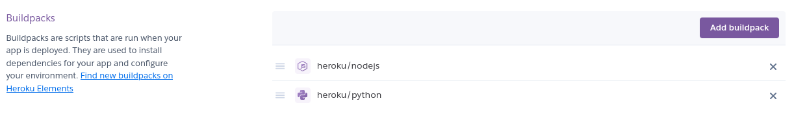
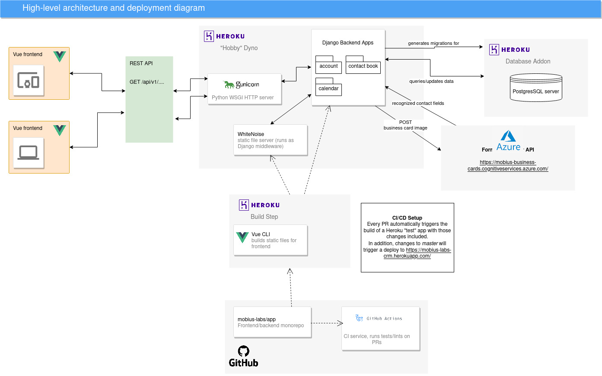

## Deployment

[[back to README]](../README.md)

To deploy this application for yourself, rather than using our hosted instance at https://mobius-labs-crm.herokuapp.com/, the easiest way would be to use Heroku, since this repo already contains some useful Heroku configuration.

Heroku has published instructions for deploying a Django app here: https://devcenter.heroku.com/articles/deploying-python

Since we decided to use a monorepo and combine our frontend and backend, Heroku may have trouble detecting the correct buildpacks and the correct order to run them (see https://devcenter.heroku.com/articles/using-multiple-buildpacks-for-an-app).
The included `app.json` should specify the correct defaults, but if for some reason it doesn't work, then you may need to manually set the correct order for buildpacks to run.

The correct configuration should look like this (first the frontend is built, and then it is included as static files inside the backend):



## Optional extra: Azure-form recognition service

This is an optional extra, and is not required for your deployed app to function, but if you wish to use the "business card scanning" functionality provided through an external Azure service, you'll need to create your own API key, and set the following environment variables:

```
AZURE_FORM_RECOGNIZER_ENDPOINT= ...
AZURE_FORM_RECOGNIZER_KEY= ...
```

The Django app will read these environment variables and use them to connect to Azure.

To obtain your own API key, you'll need an Azure subscription (you can get one for free), and then create a "Form Recognizer" instance. View Azure's own documentation for more detail: https://docs.microsoft.com/en-us/azure/applied-ai-services/form-recognizer/concept-business-card#try-form-recognizer. You can then grab the endpoint and API key from here:


## High-level architecture

Here is a diagram explaining how our app is deployed in production:

